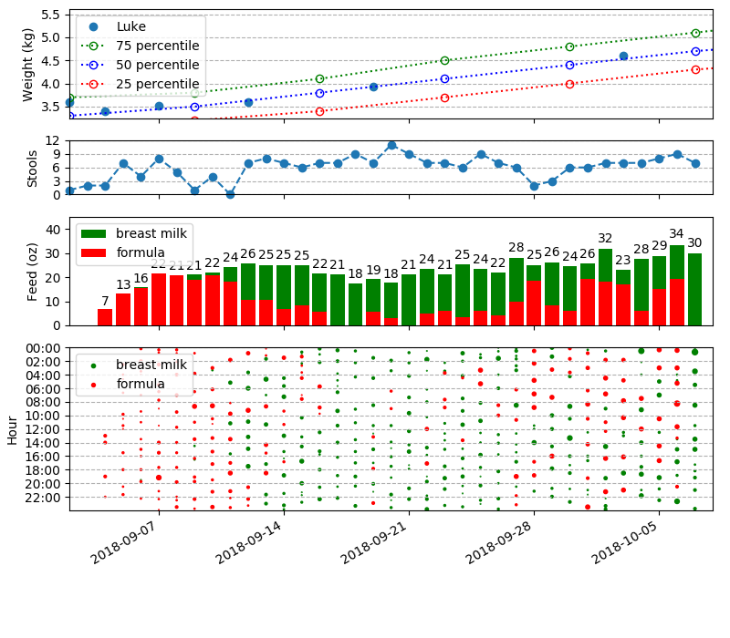

# track Luke's feeding pattern

To generate the figure below, run

```bash
python3 analyze.py
```



The World Health Organization (WHO) weight guideline can be downloaded [here](http://www.who.int/childgrowth/standards/weight_for_age/en/).
